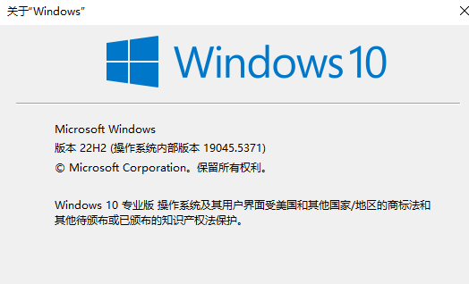
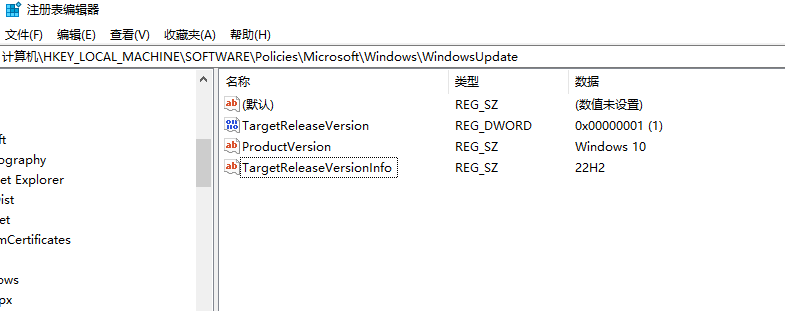

# 阻止win10自动升级到win11

参考链接🔗：[how-to-keep-windows-10-from-updating-to-windows-11](https://www.ubackup.com/tw/windows-11/how-to-keep-windows-10-from-updating-to-windows-11-0024-tc.html)

微软时不时会将符合硬件要求的win10电脑偷偷自动升级到win11，但是为了避免关键工作软件和驱动的兼容风险，必须阻止Win10 设备自动升级到 Win11。下面介绍的是，通过注册表编辑器阻止win10升级到win11（适用于所有版本的 Windows 10）
## 一、检查win10当前版本
使用修改注册表的方法，既可以在专业版win10使用，又可以在家庭版、教育版win10使用，但也不能是太早的win10版本（自 Windows 10 版本 1803 起可用），它允许用户指定希望留在或移至的 Windows 10 目标功能升级，直到其服务终止。

最新的 Windows 10 版本是 22H2。但在開始之前，需要檢查您的電腦是否使用該版本。按下 `Win + R` 键，输入`winver`，然后按回车。接著，將看到當前的 Windows 版本：



## 二、打开注册表编辑器：
+ 按下 `Win + R` 键，输入 `regedit`，然后按回车。

### （一）导航到相关注册表项：
+ 在注册表编辑器中，导航到以下路径： 

```plain
HKEY_LOCAL_MACHINE\SOFTWARE\Policies\Microsoft\Windows\WindowsUpdate
```

### （二）创建或修改注册表项：
+ 如果 `WindowsUpdate` 项不存在，右键点击 `Microsoft`，选择“新建 -> 项”，并将其命名为 `WindowsUpdate`。
+ 在 `WindowsUpdate` 项下，右键点击空白处，选择“新建 -> DWORD (32 位) 值”，并将其命名为 `TargetReleaseVersion`，双击打开后将其值设置为 `1`。
+  右键點擊空白處，選擇新增>字串值。然後，輕按兩下它，將其命名為`ProductVersion`，並將其值數據設定為`Windows 10`。
+ 再次右键点击空白处，选择“新建 -> 字符串值”，并将其命名为 `TargetReleaseVersionInfo`。
+ 双击 `TargetReleaseVersionInfo`，将其值设置为 `22H2`（或你希望停留的 Windows 10 版本号）。



### （三）重启电脑：
+ 重启电脑以使更改生效。

